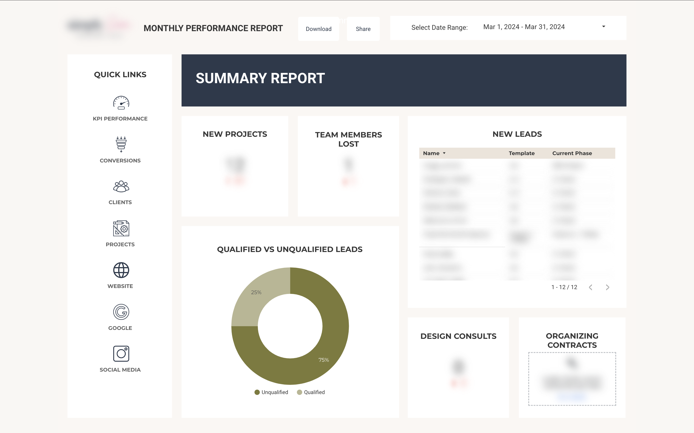

# Service Business Performance Dashboard

## Summary

This project demonstrates the design and development of a comprehensive business intelligence dashboard for a small service-based business. By leveraging no-code and low-code solutions, I created an automated data pipeline that integrated multiple data sources including CRM, project management, scheduling, marketing, and social media platforms. The system eliminated manual data collection processes while providing actionable insights across client acquisition, team performance, and marketing effectiveness.

Key technical achievements included:

* Design of a scalable data warehouse architecture using Google Sheets  
* Development of automated data collection workflows through API integrations  
* Creation of interactive visualizations for real-time decision support  
* Implementation of documentation and processes enabling non-technical team maintenance

While the dashboard wasn't implemented in production, the design demonstrated how small service businesses can leverage modern data integration tools to make data-driven decisions without significant technical infrastructure investment.

## Business Problem

A service business faced the challenge of scaling operations while maintaining quality and profitability. They needed to understand the impact of various aspects of their business in order to:

* Balance team workload with new client acquisition  
* Identify early warning signs of client or employee churn  
* Determine optimal project pricing and resource allocation  
* Track ROI across all business investments  
* Focus marketing efforts on the most profitable services

## Methodology

### Tools Used

* Looker Studio (Google Data Studio)  
* Google Sheets  
* Google App Script  
* Zapier  
* API Connector extension

## Data Integration System

### Business Challenge

The organization needed to track business performance across multiple platforms (CRM, project management software, social media, Google Ads, and email marketing) but was spending excessive time on manual data collection, cleaning, and consolidation. This manual process led to:

* Delayed reporting  
* Increased risk of data entry errors  
* Limited ability to spot trends in real-time

### System Architecture

Created an automated data pipeline using no-code and low-code tools:

* Zapier for workflow automation and data routing  
* API Connector for direct API integrations with social media platforms  
* Google Apps Script for collecting CRM, project management, and public social media data  
* Google Sheets as a centralized data warehouse  
* Looker Studio for visualization and reporting

** Overview of System Architecture: **
  [![](https://mermaid.ink/img/pako:eNqNVdtu2zgQ_RVCReAtQAPdbbZN9VBAiZXGiN0IkdsCqfaBlsY2NxQpUFQbNcm_d0jKFynNdvVgS5wz13NI3ge5KiAIg6Ojey65Ccl9JgkZmQ2UMArJaMlqGNH92memOVsKqEcdFA0rJc05K7lorcdUGtCUjFlVCRjXbW2gpMT_jxtOSRaksFZAPk2zgJJrtVRG2dULEN_A8JyRj9CAtUWYS_jsmKbSvGS6PVNCaZvoxd-nb-L4z6F9AXdmj1m5Z4cRXMLe-O44en16MrK2x0w-Ph4dZTKTK6G-5xumDVlMvFvdLNeaVRsS32FvkgkyYYaRVDU6h9pj7HN2Pf_jaxbgH0kEMyulyyz45-UekJ5dxBMLSfMNFA1Ws34GmbhIiVb_Qm7InEm2xulLM4jnUKnKcU5kDgVnJMLyWpxi3Ud-iU8t9Assa27gOVQ8j6Yzi4tLxjEi07fIiFwPUYnHVEK1AG4YewTIwk6xNzc3LisM_DRcSTJjLeiDPi7ieJHaoB-UWgsg6QbADIq7iZJpfG1BN6zioEnUGFW6eAMkAi0M_8iZkhInqPQQkRymi6qqJmmueWX-u5HPvG6Y4D9-2cXs6urSFzhT6hYLTE1TcIXd15ulYrro17ALegktkme0pWNndXqaTeOPCycpwZH852izzyKOnBgWwEqSgLaSYjKHp8j55eKDRe7YJddX0z7MtT6YgVX1ePyePHRjhwK3Q6W0eeiY8TAncQ-coIZakrYy70OSLtAF7p8dwDLSRdjmQfoONGMhU49AMXcZuLbboyPZgTwJHufk_H-KRkV7GG405JfE0uj2oZPldgDeweG2hk5sv1hL0ieL_t0tb4v0Bv_lDJ7xJ8uW3CeLlsdtiFywup7AinSHIFlxIcLuhKS5PfHC7xvc-VTfhX-9GjjVkCtZ7N3Oj0-O35z_1o0fbGjv-O78bRRHv3X81ttFnevk9PXJ8dD1Va9Bq0HqBEYTfJlTFAJ1JFPLYNf7oYOfOfXUUfyljppdw4dYP1p62FYvt6OGWiqoHX2_i4AGJeCO4wVepu5izAJ3YWZBiK-Y6zYL8I5BHEMpWs0HodEN0ECrZr0JwhUTNX41VYEynXCGJZS71YrJG6X233jU45k293e3u8IffwL9rWDs?type=png)](https://mermaid.live/edit#pako:eNqNVdtu2zgQ_RVCReAtQAPdbbZN9VBAiZXGiN0IkdsCqfaBlsY2NxQpUFQbNcm_d0jKFynNdvVgS5wz13NI3ge5KiAIg6Ojey65Ccl9JgkZmQ2UMArJaMlqGNH92memOVsKqEcdFA0rJc05K7lorcdUGtCUjFlVCRjXbW2gpMT_jxtOSRaksFZAPk2zgJJrtVRG2dULEN_A8JyRj9CAtUWYS_jsmKbSvGS6PVNCaZvoxd-nb-L4z6F9AXdmj1m5Z4cRXMLe-O44en16MrK2x0w-Ph4dZTKTK6G-5xumDVlMvFvdLNeaVRsS32FvkgkyYYaRVDU6h9pj7HN2Pf_jaxbgH0kEMyulyyz45-UekJ5dxBMLSfMNFA1Ws34GmbhIiVb_Qm7InEm2xulLM4jnUKnKcU5kDgVnJMLyWpxi3Ud-iU8t9Assa27gOVQ8j6Yzi4tLxjEi07fIiFwPUYnHVEK1AG4YewTIwk6xNzc3LisM_DRcSTJjLeiDPi7ieJHaoB-UWgsg6QbADIq7iZJpfG1BN6zioEnUGFW6eAMkAi0M_8iZkhInqPQQkRymi6qqJmmueWX-u5HPvG6Y4D9-2cXs6urSFzhT6hYLTE1TcIXd15ulYrro17ALegktkme0pWNndXqaTeOPCycpwZH852izzyKOnBgWwEqSgLaSYjKHp8j55eKDRe7YJddX0z7MtT6YgVX1ePyePHRjhwK3Q6W0eeiY8TAncQ-coIZakrYy70OSLtAF7p8dwDLSRdjmQfoONGMhU49AMXcZuLbboyPZgTwJHufk_H-KRkV7GG405JfE0uj2oZPldgDeweG2hk5sv1hL0ieL_t0tb4v0Bv_lDJ7xJ8uW3CeLlsdtiFywup7AinSHIFlxIcLuhKS5PfHC7xvc-VTfhX-9GjjVkCtZ7N3Oj0-O35z_1o0fbGjv-O78bRRHv3X81ttFnevk9PXJ8dD1Va9Bq0HqBEYTfJlTFAJ1JFPLYNf7oYOfOfXUUfyljppdw4dYP1p62FYvt6OGWiqoHX2_i4AGJeCO4wVepu5izAJ3YWZBiK-Y6zYL8I5BHEMpWs0HodEN0ECrZr0JwhUTNX41VYEynXCGJZS71YrJG6X233jU45k293e3u8IffwL9rWDs)

### Technical Implementation Details

#### API Connector Setup

* Configured API endpoints for Instagram and Facebook  
* Created semi-automated refresh schedules  
* Developed data transformation rules for consistency

#### Zapier Workflow Design

* Built multi-step automation workflows  
* Implemented conditional logic for data routing

#### Data Warehousing

* Designed Google Sheets structure for optimal performance  
* Implemented data validation and cleaning procedures  
* Developed documentation for maintenance and troubleshooting

## Dashboard Components

### Client Metrics

The client analytics dashboard integrated data from multiple sources to provide a comprehensive view of the client lifecycle. The system tracked acquisition channels while highlighting the critical role of word-of-mouth referrals through detailed source attribution. A custom retention analysis framework monitored client loss ratios and retention rates, with particular attention to retention patterns by acquisition source. This enabled the team to identify the most valuable client acquisition channels and optimize resource allocation accordingly.

### Team Performance

Team analytics focused on key stability metrics including employment duration and termination rates. The dashboard was designed with future integration points for team satisfaction metrics, enabling proactive identification of potential retention issues. This data-driven approach to team management supported better resource allocation and workload balancing decisions.

### Marketing & Sales

The marketing dashboard unified data from multiple platforms into a coherent funnel visualization, tracking conversion rates at each stage from initial contact through project completion. Platform-specific metrics for Google, social media, and email marketing provided granular performance insights. A particularly valuable feature was the analysis of content performance across blog posts and email campaigns, helping identify the most effective messaging strategies for different audience segments.

## Technical Challenges & Solutions

The project involved several complex technical challenges. Data standardization across varying time scales required careful design decisions, particularly when combining event-based and periodic data collection. Building reliable automated collection processes and integrating with the custom-built Coda project management platform demanded sophisticated Google Apps Script implementation. Additionally, since I was the only team member with technical expertise, creating comprehensive documentation and designing intuitive interfaces for non-technical users was crucial for system sustainability.

### Results & Impact

While the dashboard wasn't implemented in production, its design demonstrated several key innovations in business intelligence for service organizations:

* Automated data integration reducing manual reporting time by eliminating multiple data entry points  
* Unified view of business performance across marketing, sales, and operations  
* Systematic monitoring of periodic client and team feedback to identify trends and potential issues  
* Data-driven decision support for resource allocation and pricing strategies

### Lessons Learned

This project reinforced the importance of balancing technical sophistication with practical usability. Key insights included:

* Prioritizing data standardization early in the development process  
* Designing for maintainability by non-technical users  
* Building flexible systems that can accommodate future metric integration  
* Creating documentation that serves both technical and non-technical audiences
